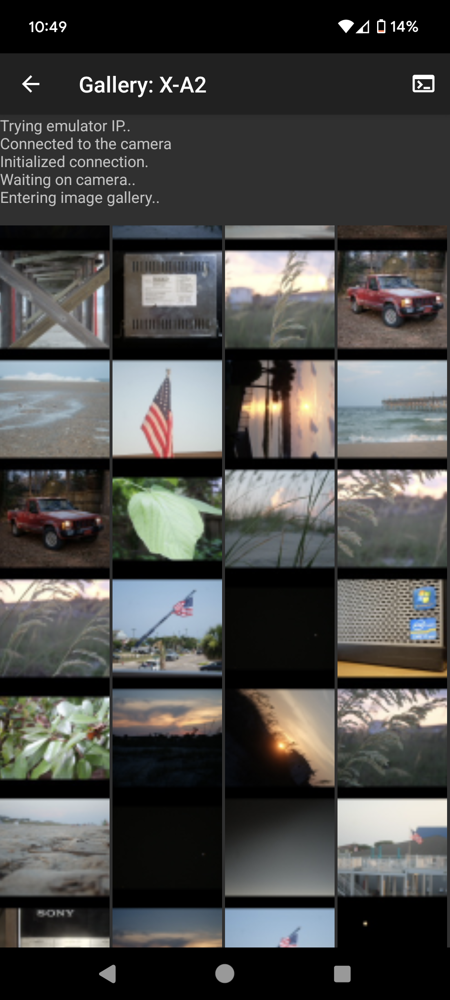
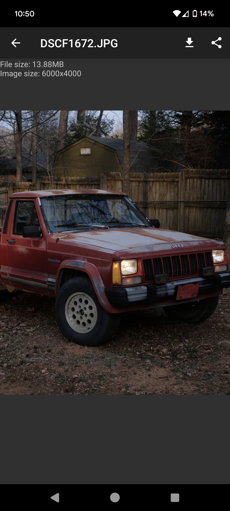

# Fudge
This is a cross-platform open-source alternative to Fujifilm's official camera app.

## Improvements over XApp / Camera Connect
- Location and notification permissions are *not* required
- *Much* more responsive native UI
- Performance improvements
- USB-OTG connectivity support
- Lua plugins API

This app isn't finished yet, so don't set high expectations. Fuji's version of PTP/IP has many different quirks and features, so it's not easy to implement them all from
a single camera. Currently, it's only been tested on a few older cameras, but functionality for newer cameras will slowly be implemented (as well as bluetooth) over time.

Beta builds are published on [Google Play](https://play.google.com/store/apps/details?id=dev.danielc.fujiapp). The latest builds are also available on [F-Droid](https://apt.izzysoft.de/fdroid/index/apk/dev.danielc.fujiapp).

## Roadmap

- [x] Stable PTP/IP communication with camera over WiFi
- [x] Tested & working on X-A2, X-H1
- [x] Tested & working on a few [virtual](https://github.com/petabyt/vcam) cameras
- [x] Gallery of images
- [x] Zoomable image viewer, download/share photos
- [x] Implement "select multiple / single" mode
- [x] Implement PTP/USB OTG support
- [x] Lua scripting
- [x] AutoSave and tether mode
- [ ] Mass photo import (different folder for each camera?)
- [x] Camera properties (ISO, white balance, film sim, etc)
- [ ] Implement Bluetooth communication (use cross-platform lib? [Rust](https://github.com/deviceplug/btleplug)?)
- [ ] Liveview & Remote capture
- [ ] Desktop app/utility
- [ ] iOS port (see ios/)
- [ ] Delete images?
- [ ] Translate UI
- [ ] Support landscape mode

## Libraries
- [camlib](https://github.com/petabyt/camlib)
- Lua 5.3
- libui-android libuilua
- libjpeg-turbo
