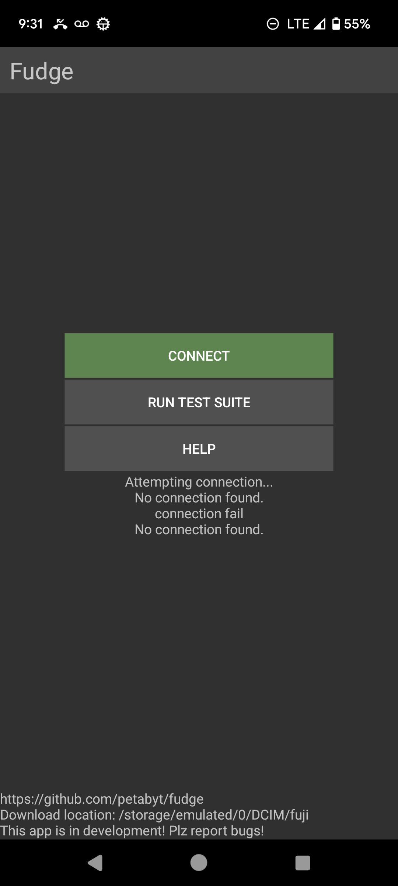
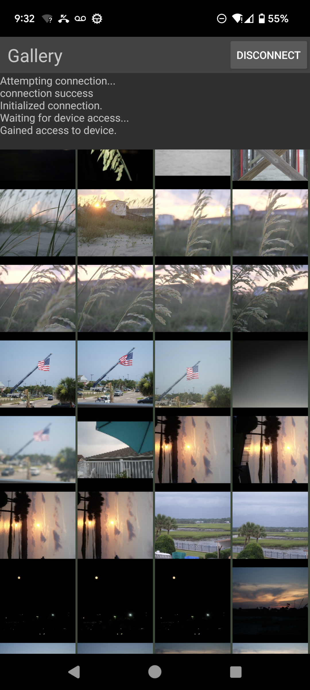
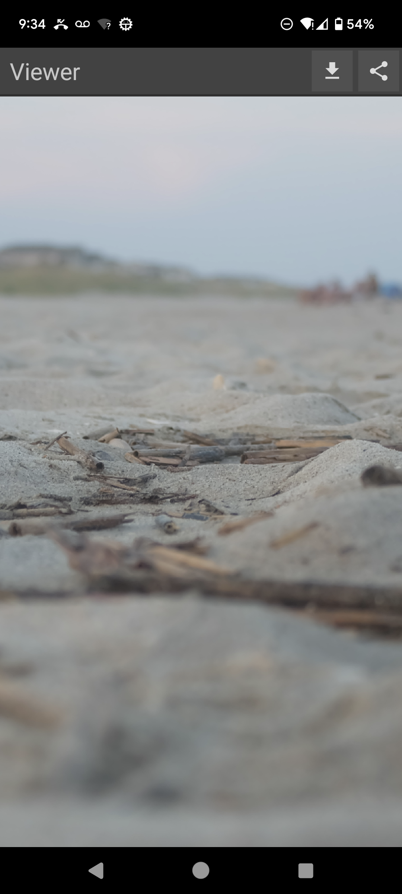

# Fudge
This is a reverse-engineered alternative to Fujifilm's official WiFi app. The short-term goal is to serve as a simple photo gallery and downloader, and focus primarly on reliability.

## Improvements over XApp / Camera Connect
- Location and notification permissions are not required
- *Much* more responsive UI, with native design
- Gallery and image downloading is slightly faster

This app isn't finished yet, so don't set high expectations. Fuji's version of PTP/IP has many different quirks and features, so it's not easy to implement them all from
a single camera. Currently, it's only been tested on a few older cameras, but functionality for newer cameras will slowly be implemented (as well as bluetooth) over time.

Beta builds are published on [Google Play](https://play.google.com/store/apps/details?id=dev.danielc.fujiapp). The latest builds are also available on [F-Droid](https://apt.izzysoft.de/fdroid/index/apk/dev.danielc.fujiapp).

## Roadmap
- [x] Stable communication with camera over WiFi
- [x] Tested & working on X-A2, X-H1
- [x] Tested & working on [virtual](https://github.com/petabyt/vcam) X-S10 and X-T20
- [x] thumbnail gallery of images
- [x] ZoomView image viewer + button to download to DCIM/fuji
- [x] Working Downloading progress bar
- [x] Download and Share images
- [x] Implement "select multiple / single" mode
- [ ] Delete images?
- [ ] Translate UI
- [ ] Implement PTP/USB OTG support
- [x] Lua scripting API
- [ ] Implement Bluetooth communication (use cross-platform lib? [Rust](https://github.com/deviceplug/btleplug)?)
- [ ] iOS port
- [ ] Implement liveview (MJPEG stream on another port)
- [ ] Remote capture
- [ ] Camera properties (ISO, white balance, film sim, etc)

## Tech stack
- Java & native Android activities
- Backend implemented in portable C
- [camlib](https://github.com/petabyt/camlib)
- Lua 5.3 + libui & camlib bindings
- LibUI (android backend)
