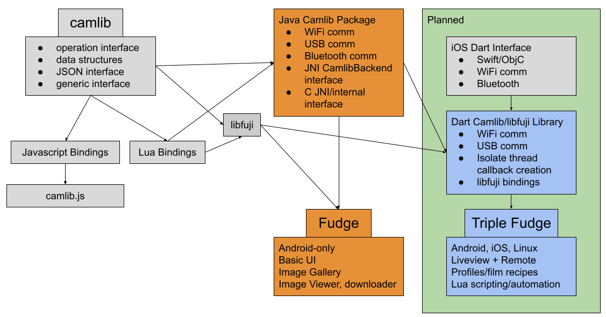

# Fudge
This is a reverse-engineered alternative to Fujifilm's official WiFi app. This is an Android-only project with a very simple goal to serve as a photo viewer
and downloader. It will also serve as a testbed for a portable implementation Fujifilm's superset of PTP/IP, and eventually a more advanced and cross-platform app in the future.

This app isn't finished yet, so don't set high expectations. Fuji's version of PTP/IP has many different quirks and features, so it's not easy to implement them all from
a single camera. Currently, it's only tested on the X-A2, but functionality for newer cameras will slowly be implemented (as well as bluetooth) over time.

Beta builds are published on [Google Play](https://play.google.com/store/apps/details?id=dev.danielc.fujiapp).

## Tech stack
- Java & native Android activities
- JNI & Portable C99
- [camlib](https://github.com/petabyt/camlib) with Java communication backend

## TODO:
- [x] Stable communication with camera (connect, disconnect, ping)
- [x] Poll camera for unlocked event
- [x] Tested & working on X-A2
- [x] thumbnail gallery of images
- [x] ZoomView image viewer + button to download to DCIM/fuji
- [x] Downloading progress bar popup
- [x] Share images (Discord doesn't seem to like it)
- [ ] Implement Bluetooth communication (decode encrypted packets)
- [x] Polish UI (more animations)
- [ ] Implement 100s of Fuji property codes, determine the unknown ones
- [x] Implement liveview (video stream on another port)
- [ ] Reimplement front-end in Flutter

## Development Structure

