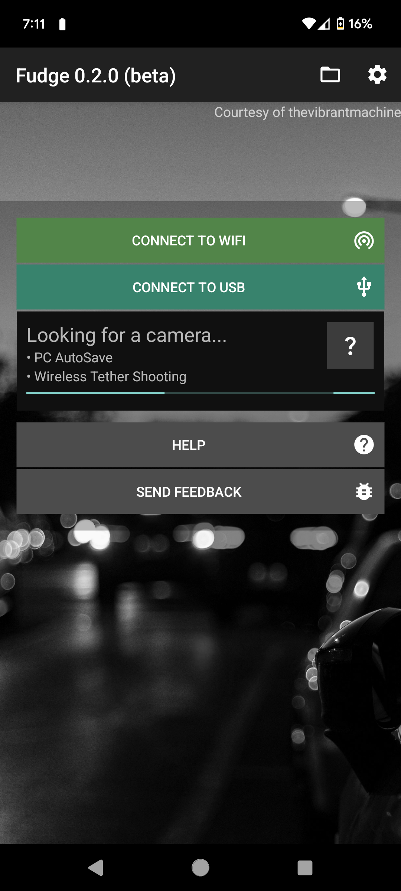
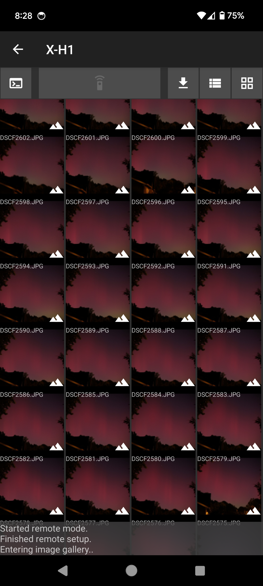
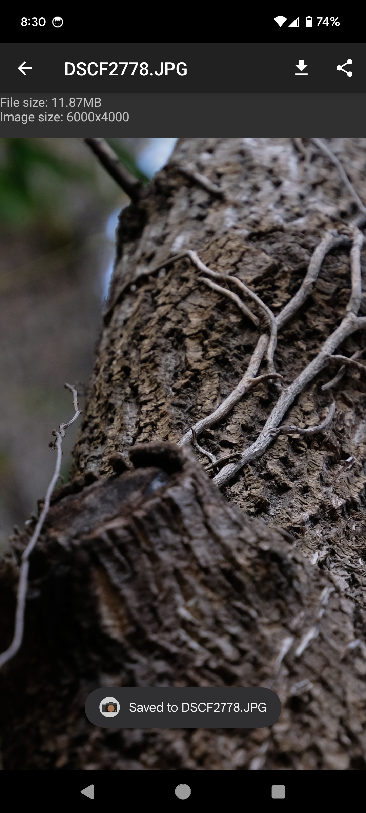

# Fudge
This is a cross-platform open-source alternative to Fujifilm's official camera app.  

[Website](https://fudge.danielc.dev/) | [Google Play](https://play.google.com/store/apps/details?id=dev.danielc.fujiapp) | [F-Droid](https://apt.izzysoft.de/fdroid/index/apk/dev.danielc.fujiapp)



## Roadmap
- Frontend rewrite (see https://github.com/petabyt/fudge/issues/26)
- Liveview & Remote capture
- Implement Bluetooth pairing

## Compiling
```
git clone https://github.com/petabyt/fudge.git --depth 1 --recurse-submodules
```

### Compiling Android
Open android/ in Android Studio.

# Credits
[libjpeg-turbo](https://github.com/libjpeg-turbo/libjpeg-turbo) (IJG License, Modified (3-clause) BSD License)  
This software is based in part on the work of the Independent JPEG Group.

[ezxml](https://ezxml.sourceforge.net/) (MIT License)

[lua 5.3](https://www.lua.org/license.html) (MIT License)

[com.jsibbold:zoomage](https://github.com/jsibbold/zoomage/blob/master/LICENSE)
