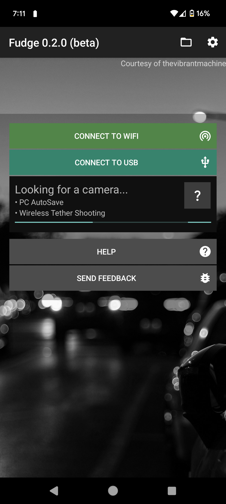
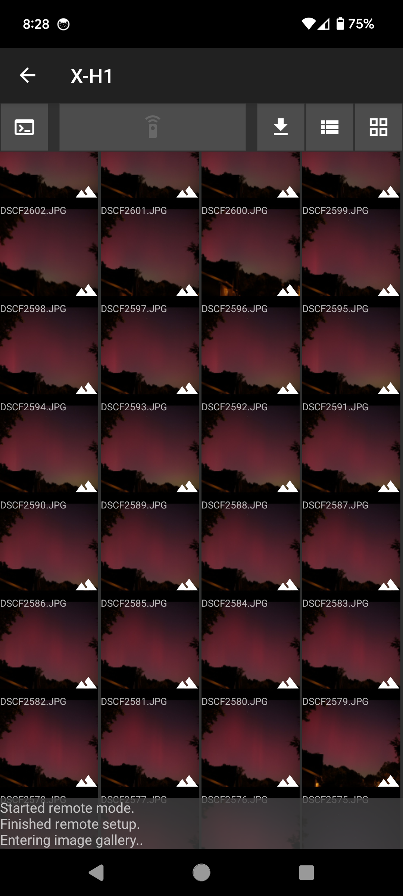
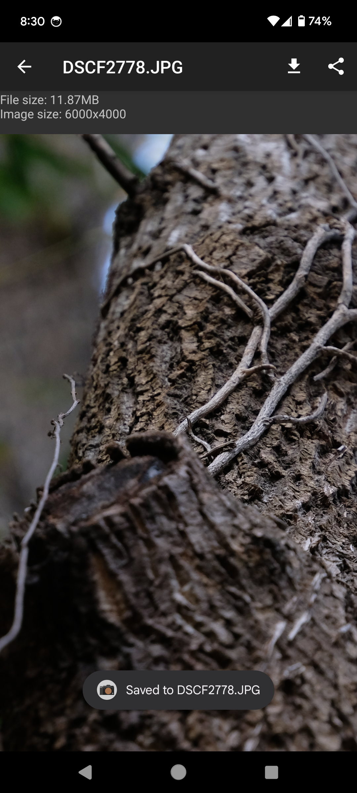

# Notice (Feb 2026)

Some changes will be made to Fudge:

- The current Fudge app written in XML/Java is deprecated and will be deleted
- libfuji (lib/) development will continue in this repo: https://github.com/petabyt/libfuji
- Raw conversion CLI/GUI has been split off into this repo: https://github.com/petabyt/fudge-desktop-legacy
- A new Android app is being rewritten using Jetpack Compose/Kotlin
- This app will support Fujifilm's WiFi USB features as before. Bluetooth pairing support will also be added.
- Support for other camera brands will be added

---

# Fudge
This is a cross-platform open-source alternative to Fujifilm's official camera app.  

[Website](https://fudge.danielc.dev/) | [Google Play](https://play.google.com/store/apps/details?id=dev.danielc.fujiapp) | [F-Droid](https://apt.izzysoft.de/fdroid/index/apk/dev.danielc.fujiapp)




### Connecting Over Wifi
**Connecting Via a Wi-Fi connection (Connect to Wifi)**
- To connect via a wifi connection, first go to the wireless connection settings page on your camera
- Then connect to your camera's wifi connection eg. **FUJIFILM-*-\*\*-\*\*\*\***. The app would show a popup to connect to the device, if not you can directly connect using your phone's settings.
- After you have connected, your camera will promt for you to accept the connection if you are connecting for the first time. Press ok.
- Your camera should be successfully connected.

**Connect with logs (Developer Testing)**
- If you arent able to successfully connect, you may **hold the "Connect to Wifi" button**
- And do the same process from "Connecting Via a Wi-Fi Connection" 
- This page allows you to view and copy the plausible errors.

**Using PC Autosave**
- Go to your camera settings SET-UP -> CONNECTION SETTINGS -> PC AUTO SAVE -> PC AUTOSAVE SETTINGS.
- For **Simple Setup:**
  - Push the WPS BUTTON on your Wi-Fi Router until the lamp on Wi-Fi router starts flashing
- For **Manual Setup:** 
  - For easier setup (Wi-Fi connection is not hidden) use SELECT FROM NETWORK LIST select your network, and enter the password.
- Your phone and camera should be on the same network.

## Roadmap
- Frontend rewrite (see https://github.com/petabyt/fudge/issues/26)
- Liveview & Remote capture
- Implement Bluetooth pairing

## Compiling
```
git clone https://github.com/petabyt/fudge.git --depth 1 --recurse-submodules
```

### Compiling Android
Open android/ in Android Studio.

# Credits
[libjpeg-turbo](https://github.com/libjpeg-turbo/libjpeg-turbo) (IJG License, Modified (3-clause) BSD License)  
This software is based in part on the work of the Independent JPEG Group.

[ezxml](https://ezxml.sourceforge.net/) (MIT License)

[com.jsibbold:zoomage](https://github.com/jsibbold/zoomage/blob/master/LICENSE)
