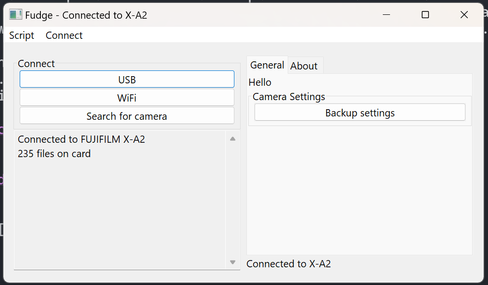

# Fudge Desktop App

Fujifilm has several desktop apps:

- FUJIFILM TETHER APP
- FUJIFILM X Acquire
- FUJIFILM X RAW STUDIO
- FUJIFILM PC AutoSave
- FUJIFILM X Webcam

Would it be worth it to create an 'all in one' Fudge replacement app?

The way I see, it, there are two main reasons for creating replacement(s) for these:
## No CLI options or plugins
None of these apps have command line options or have the ability to be scripted/automated/customized. It wouldn't be honest to call
any of their apps 'bad' because of this, they are all serving their intented purpose to Fuji's customers. But it means that it's impossible
to automate things, add functionality, ..........

Fujifilm has an [SDK](https://fujifilm-x.com/global/special/camera-control-sdk/) but this has a serparate set of problems (that can be addressed sometime later).

## No Linux Support
Linux is becoming a more viable platform every day, especially as Proton/Wine and app compatibility improves. Given that it only accounts for 4.31% of desktop market share, it makes
sense for Fujifilm to not support it, especially given the open-source culture. Still, a Linux port is sorely needed, especially as Microsoft and Apple tighten their grips on users.

Note that Fuji's USB software won't work through Wine because it lacks a WPD layer.

And a few nitpicks:

- None support HiDPI scaling on Windows? Come on Fuji.
- PC AutoSave is truely awful on Windows.

